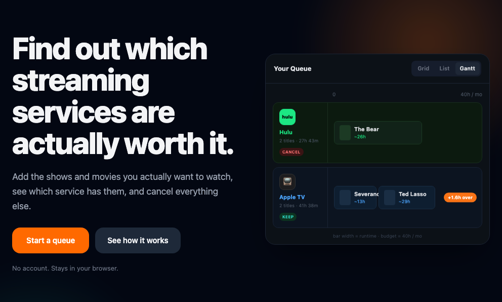
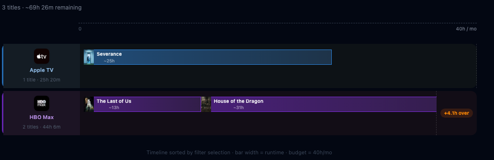

# Queuest

**Find out which streaming services are actually worth it.**

Queuest lets you build a watch queue, see which services carry each title, and estimate whether your backlog fits inside a single month of a given subscription. Stop auto-renewing things you're not watching.

---

## Showcase

**Landing page** — hero with interactive demo, service-aware queue filters, and how-it-works callout:



**Queue view** — Grid, List, and Gantt visualizations with provider swimlanes, runtime sparklines, and per-season progress tracking. Filter by subscribed services, watched status, and sort order:



---

## How it works

### 1. Build your queue
Search for movies and TV shows by name. Queuest pulls metadata from TMDB — poster, runtime, cast, genres, and which streaming services carry the title in the US (via JustWatch data). Tap any result to open a detail panel with the full picture before you add it. Add anything you want to watch to your queue.

### 2. See your subscription value
The **Gantt view** groups your queue by provider. Each bar's width represents watch time relative to your monthly viewing budget (configurable on the Budget page). If a provider's lane fits inside one bar-width, one month is all you need.

The **Suggest** tab ranks providers by total remaining watch time across your unwatched titles — useful for deciding what to subscribe to first. Checking off seasons reduces a show's contribution automatically.

### 3. Your data, your device
Everything is stored locally in your browser's IndexedDB — no account, no server, no tracking. Use **Settings → Export** to save a passphrase-encrypted `.queuest` file you can restore on any device. The backup includes your full queue, theme, budget, sort and view preferences, queue name, and shared queue colors — a complete restore.

---

## Features

- 🔍 **Search** movies and TV shows (TMDB) with a detail panel showing cast, providers, seasons, and release dates before you add
- 📺 **Streaming providers** per title (JustWatch / US) — with bundle filtering and Disney+ inference (see below); Rent/Buy indicator when a title isn't on subscription services; Kanopy and Hoopla library links when it isn't streaming at all
- 📅 **Upcoming release dates** — theatrical windows, estimated streaming dates, and next-season/next-episode dates surfaced on every card; mid-season episodes distinguished from season premieres
- 📊 **Gantt view** — lane-per-provider, bar width = remaining watch time vs. monthly budget; runtime sparklines in Grid and List too
- 📋 **List & Grid views** with sort (A–Z, runtime, date added, watched)
- 🎬 **Detail panel** — tap any title for poster lightbox, full overview, cast, genres, provider list, and per-season progress
- ✅ **Watch tracking** — mark titles done, filter To Watch / Watched; season-level progress (with episode counts) shrinks bar widths automatically
- 🏷️ **Named queues** — tag items into named queues and assign each a custom color; imported shared lists land in their own color-coded queue automatically
- 🏆 **Suggest** — providers ranked by total remaining watch time in your queue
- 🔗 **Encrypted share links** — share a filtered subset of your queue as a short URL; filter by provider, type, or queue before sharing; decryption key lives only in the URL fragment; links expire after 30 days
- 🔒 **Encrypted export / import** — AES-GCM + PBKDF2 via Web Crypto API; restores queue, preferences, view settings, and shared queue colors completely
- 🌙 **Dark / light mode** — persisted in preferences and backup file
- ⏱ **Viewing budget** — configurable monthly hours (hrs/week × weeks/month) on the Budget page, used to normalise bar widths
- 🔄 **Refresh provider data** — re-fetches streaming info for every queued title in one click (Settings)
- 💬 **In-app feedback** — files a GitHub issue directly from Settings

---

## Stack

| Layer | Technology |
|---|---|
| Framework | [SvelteKit 2](https://kit.svelte.dev) + [Svelte 5](https://svelte.dev) (runes) |
| Styling | [Tailwind CSS v4](https://tailwindcss.com) (Vite plugin, class-based dark mode) |
| Storage | [IndexedDB](https://developer.mozilla.org/en-US/docs/Web/API/IndexedDB_API) (client-side, no server DB) |
| Crypto | [Web Crypto API](https://developer.mozilla.org/en-US/docs/Web/API/Web_Crypto_API) — AES-GCM encryption, PBKDF2 key derivation |
| Data | [TMDB API](https://developer.themoviedb.org) — search, metadata, JustWatch provider data |
| Hosting | [Cloudflare Pages](https://pages.cloudflare.com) |
| Deployment | [@sveltejs/adapter-cloudflare](https://kit.svelte.dev/docs/adapter-cloudflare) |

---

## Development

```bash
npm install
npm run dev
```

You'll need a [TMDB API key](https://developer.themoviedb.org/docs/getting-started). Copy `.env.example` to `.env.local` and fill it in — this is what `npm run dev` reads:

```
TMDB_API_KEY=your_key_here
```

To enable in-app feedback (creates GitHub issues from Settings), add a fine-grained GitHub PAT with **Issues: Read & write** on this repo:

```
GITHUB_TOKEN=your_token_here
```

### Build & preview (Cloudflare)

```bash
npm run build
npm run preview   # uses wrangler pages dev
```

`npm run preview` runs through `wrangler`, which reads `.dev.vars` instead of `.env.local`. Copy `.env.example` to `.dev.vars` as well if you want a working TMDB key in preview mode.

---

## Data & Privacy

- No user accounts. No analytics. No cookies.
- All watch data lives in your browser's IndexedDB and never leaves your device unless you export it.
- Provider data is sourced from TMDB/JustWatch and reflects US availability only. It can lag real-world changes by a few days.
- This product uses the TMDB API but is not endorsed or certified by TMDB.

### A note on Disney+ data

Disney+ removed their catalogue from JustWatch, so TMDB's watch/providers API returns no Disney+ entries for the US. Queuest works around this by inferring Disney+ availability from first-party TMDB metadata that is still present — the show's network (Disney+) for TV, and the production company (Lucasfilm, Marvel Studios, Pixar, Walt Disney Pictures, Walt Disney Animation) for films. This correctly attributes titles like Star Wars, the MCU, and Loki to Disney+ rather than showing them as unavailable or mislabelled as Hulu. FX/Hulu originals like The Bear are unaffected. Use **Settings → Refresh provider data** if anything looks wrong after a streaming rights change.

---

## Known limitations

- Provider data is US-only (JustWatch regional restriction via TMDB)
- Bundle-only availability (e.g. Hulu + Disney+ bundle) is filtered where detected; Disney+ data is inferred rather than sourced directly — see [#5](https://github.com/zenfinity/streamq/issues/5)
- Importing watchlists from Letterboxd, Trakt, or IMDb is planned — see [#4](https://github.com/zenfinity/streamq/issues/4)

---

## License

AGPL-3.0
